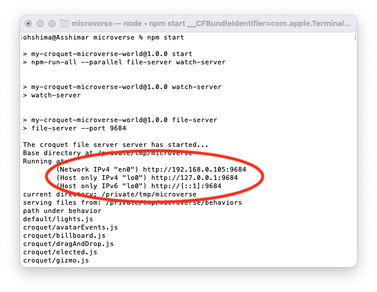
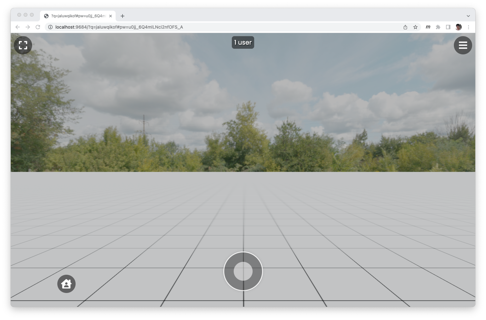

# Croquet Microverse Builder Quick Start Guide

## Introduction

This guide will enable you to quickly set up the Croquet Microverse Builder. Refer to tutorials in the docs directory for its key concepts and features that let you build shared worlds.

## Prerequisites

1. [Node](https://nodejs.org/)
2. [Git](https://git-scm.com)
3. Web browser (we recommend [Chrome](https://chrome.google.com/) at this time)

Our tools are written in JavaScript and need Node.js to run. In particular the `npm` command provided by Node is used to install JS packages. Microverse Builder is hosted on GitHub and the instructions assume you use the command line `git` client to access it.

The users of your worlds do not need these tools. Microverse worlds are deployed as static web pages so only a web browser is needed to visit them.

## Installation Steps

### Clone or Fork the GitHub Repository

You can find the latest Croquet Microverse Builder along with documentation in the [`croquet/microverse`](https://github.com/croquet/microverse) repository on GitHub. Cloning this repository will give you almost everything you will need to get started creating your own Croquet Microverse.

`git clone https://github.com/croquet/microverse.git`

Alternatively, fork the repository to your account and clone your repository.

---
### Obtain your API Key

Any Croquet application requires an API key to access the Croquet Reflector Network.

Create a free account at [croquet.io/keys](https://croquet.io/keys/), which automatically generates a "development key". Additional application specific API keys with URL restrictions can be created as well (see the deployment section of this document for further details).

### Create the apiKey.js File
Create a file called `apiKey.js` by copying `apiKey.js-example` to `apiKey.js`. Then edit the two properties in the file named `apiKey` and `appId`. The appId needs to be [dot-separated words](https://developer.android.com/studio/build/application-id), such as "com.example.myapp". Refer to the API document of [`Session.join()`](https://croquet.io/docs/croquet/Session.html#.join) for other parameters you can specify.

#### apiKey.js-example

```
const apiKey = "paste your apiKey from croquet.io/keys";
const appId = "type your own appId such as com.example.david.mymicroverse";
export default {apiKey, appId};

// you may export other Croquet session parameters to override default values.
```

Paste your Croquet API key and type an application ID of your choice in the `apiKey.js` file and save it.

#### apiKey.js
```
const apiKey = "1_a2b3c4e5f6g7h8i9j0kxyzzyqwerty142nsj6fasdsadad";
const appId = "com.example.david.mymicroverse";
export default {apiKey, appId};
```

### Install Packages and start Microverse

Set up the local servers. In a terminal window, change to the microverse folder then run the `npm install` command to install packages:
* `cd microverse` (or the directory where the microverse repo was downloaded.)
* `npm install`

Start the local servers.  In the same terminal window, run `npm start` to start the servers.
* `npm start`

This will start two servers. The first is the file server on localhost:9684. The second is the watch-server that enables you to inject code changes into a running session.

We use the port 9684 for the file server and the port 9011 for the watch server. Make sure that your local fire wall (Windows Defender on Windows or Firewall system preferences on Mac) allows connections to those ports.

The servers can be run independently as well.
* `npm run file-server` starts the file server.
* `npm run watch-server` starts the watch-server.

You should see something similar to this:



### Open the Croquet Microverse in a browser

To enter the demo world for the Croquet Microverse, open `localhost:9684` in your web browser.



The URL will change - both a new session ID and a password are autogenerated and added to the URL. This full URL allows you to enter the same world from other tabs and devices.

If you have another device on the local network and the computer is visible from the device by an IP address, you can join in the same session from the device. Replace localhost with the IP address of the computer (such as 192.168.0.123) in the full URL and open it from other device. You can deploy the system to your server, as described in the deployment section, and make it publicly available.

### Deployment

You can copy all files in `behaviors`, `assets`, `lib`, `meta`, and `worlds` along with `index.html` and `apiKey.js` to your publicly accessible HTTP server to have your own deployment. You can also use a hosting services such as Netlify and Vercel, which let you connect your GitHub repository to automate deployment. Note that the auto generated default apiKey for your Croquet account allows anybody to use it from any site.  In order to protect your API key from unauthorized use, you should create a new apiKey with URL restriction limited to your site.

Many of files in the `assets` directory are used for the default demo worlds and may not be necessary for your own world.  You can safely remove them from your deployment if you are not using them.

### Updates

Croquet will continuously update this repository with new features and bug fixes. Most of the files affected will be under the `lib` and `assets` directory but occasionally some files in the worlds, including `default.js`, will be modified. If you edit `default.js` in your clone, fetching upstream updates may cause conflicts. Making your world file under a different name and launching it with the URL option `?world=` can avoid conflicts.

Keep it in mind that occasionally we push a commit that updates the file server or the watch server (those are only external dependencies). When an update appears to break them please re-run `npm install` to see if that fixes the issue.

## Resources
---

### Croquet.io
<https://croquet.io/> is the best place to get started with what the Croquet Microverse is and what it can do.

The Croquet Microverse uses the [Croquet Library](https://croquet.io/docs/croquet) and the [Worldcore framework](https://croquet.io/docs/worldcore). Additionaly it depends on [Three.js](https://threejs.org/) for 3D rendering. To develop your own behaviors with new visual appearances, you will need to be familiar with those libraries.

### Discord

The best resource for help in developing Croquet Microverse worlds is on our Discord server. The Croquet Discord server is where you can ask questions, view examples, and see the Metaverse being constructed while you watch. Join the [Croquet Discord server](https://discord.gg/9U9MKSbJXS).

**Copyright (c) 2022 Croquet Corporation**
